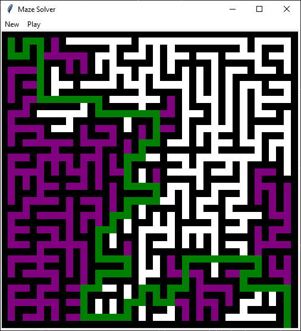

# Visualization of maze solving using the depth-first search algorithm

## How to use
On the top bar, choose "New" to load a new maze from a text file. The file must consist of `.` for an empty field and `#` for a wall. The maze must have a square shape. For example:
```
###########
#.....#...#
#####.###.#
#.........#
#.#.#.###.#
#.#.#.#.#.#
#####.#.#.#
#.....#.#.#
#.###.#.#.#
#...#.#...#
###.#######
```
If the maze is correct, it will be displayed on the screen. Click "Play" to start the animation.
## Customization
In [settings.json](settings.json) file you can change:
* x, y - Starting position. Coordinates are zero-based.
* canvas_size - Size of the canvas [px]. 
* delay - Delay after each recursive call [s].